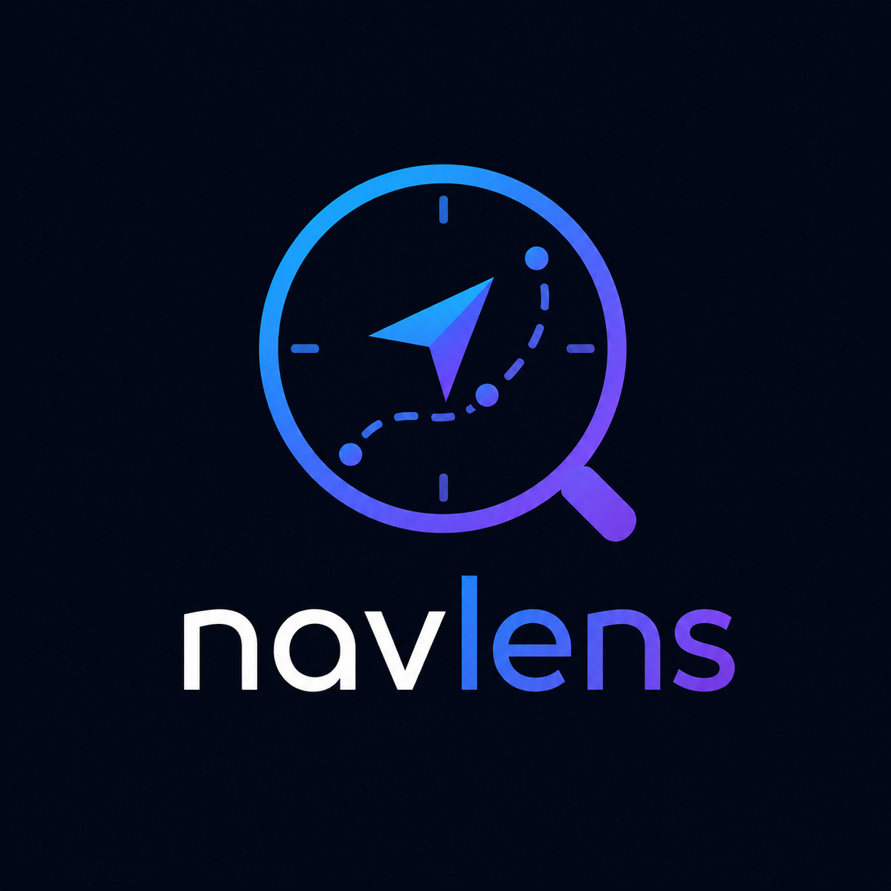

# NavLens

<p align="center">
  
</p>

<p align="center">
  Track client-side navigation history with timestamps. Exposes <code>getPreviousPath()</code> and <code>getNavHistory()</code> — you decide what to do with it.
</p>

<p align="center">
  <a href="https://www.npmjs.com/package/navlens">
    
  </a>
  <a href="https://www.npmjs.com/package/navlens">
    
  </a>
  <a href="https://www.npmjs.com/package/navlens">
    
  </a>
  <a href="https://www.npmjs.com/package/navlens">
    
  </a>
  <a href="https://bundlephobia.com/package/navlens">
    
  </a>
  <a href="https://codecov.io/gh/farzinfiroozi/navlens">
    
  </a>
</p>

<p align="center">
  
  
  
  
  
  
</p>

---

## Install

```bash
npm install navlens
# or
pnpm add navlens
# or
yarn add navlens
```

---

## Usage

###  Next.js (App Router)

Add the tracker to your root layout:

```tsx
// app/providers.tsx
"use client";
import { ReactNavigationTracker, useNextAdapter } from "navlens";
import { Suspense } from "react";

function NavigationTracker() {
  const adapter = useNextAdapter();
  return <ReactNavigationTracker adapter={adapter} />;
}

export function Providers({ children }: { children: React.ReactNode }) {
  return (
    <>
      <Suspense fallback={null}>
        <NavigationTracker />
      </Suspense>
      {children}
    </>
  );
}
```

```tsx
// app/layout.tsx
import { Providers } from "./providers";

export default function RootLayout({
  children,
}: {
  children: React.ReactNode;
}) {
  return (
    <html lang="en">
      <body>
        <Providers>{children}</Providers>
      </body>
    </html>
  );
}
```

Use in any page:

```tsx
"use client";
import { useRouter } from "next/navigation";
import { getPreviousPath } from "navlens";

export default function ProductDetailPage() {
  const router = useRouter();

  function handleBack() {
    const prev = getPreviousPath();
    if (prev) router.back();
    else router.push("/");
  }

  return <button onClick={handleBack}>← Back</button>;
}
```

→ [View example](./examples/next)

---

###  React Router v6

```tsx
// src/App.tsx
import { Routes, Route } from "react-router-dom";
import { ReactNavigationTracker, useReactRouterAdapter } from "navlens";

export default function App() {
  const adapter = useReactRouterAdapter();

  return (
    <>
      <ReactNavigationTracker adapter={adapter} />
      <Routes>
        <Route path="/" element={<HomePage />} />
        <Route path="/products" element={<ProductsPage />} />
        <Route path="/products/:id" element={<ProductDetailPage />} />
      </Routes>
    </>
  );
}
```

```tsx
// src/pages/ProductDetailPage.tsx
import { useNavigate } from "react-router-dom";
import { getPreviousPath } from "navlens";

export default function ProductDetailPage() {
  const navigate = useNavigate();

  function handleBack() {
    const prev = getPreviousPath();
    if (prev) navigate(-1);
    else navigate("/");
  }

  return <button onClick={handleBack}>← Back</button>;
}
```

→ [View example](./examples/react-router)

---

###  Vue Router

```vue
<!-- src/App.vue -->
<script setup lang="ts">
import { useVueNavigationHistory } from "navlens";
useVueNavigationHistory();
</script>

<template>
  <RouterView />
</template>
```

```vue
<!-- src/views/ProductDetailView.vue -->
<script setup lang="ts">
import { useRouter } from "vue-router";
import { getPreviousPath } from "navlens";

const router = useRouter();

function handleBack() {
  const prev = getPreviousPath();
  if (prev) router.back();
  else router.push("/");
}
</script>

<template>
  <button @click="handleBack">← Back</button>
</template>
```

→ [View example](./examples/vue-router)

---

###  Nuxt 3

```vue
<!-- layouts/default.vue -->
<script setup lang="ts">
import { useVueNavigationHistory } from "navlens";
useVueNavigationHistory();
</script>

<template>
  <slot />
</template>
```

```vue
<!-- pages/products/[id].vue -->
<script setup lang="ts">
import { getPreviousPath } from "navlens";

const router = useRouter();

function handleBack() {
  const prev = getPreviousPath();
  if (prev) router.back();
  else navigateTo("/");
}
</script>
```

→ [View example](./examples/nuxt)

---

###  Quasar

```ts
// src/boot/navlens.ts
import { boot } from "quasar/wrappers";
import { pushEntry } from "navlens";

export default boot(({ router }) => {
  router.afterEach((to) => {
    pushEntry(to.fullPath);
  });
});
```

Register in `quasar.config.ts`:

```ts
boot: ["navlens"];
```

→ [View example](./examples/quasar)

---

###  SvelteKit

```svelte
<!-- src/routes/+layout.svelte -->
<script lang="ts">
  import { afterNavigate } from '$app/navigation'
  import { createNavigationHandler } from 'navlens'

  afterNavigate(createNavigationHandler())
</script>

<slot />
```

```svelte
<!-- src/routes/products/[id]/+page.svelte -->
<script lang="ts">
  import { goto } from '$app/navigation'
  import { getPreviousPath } from 'navlens'

  function handleBack() {
    const prev = getPreviousPath()
    if (prev) history.back()
    else goto('/')
  }
</script>

<button on:click={handleBack}>← Back</button>
```

→ [View example](./examples/sveltekit)

---

## API

### `getPreviousPath(config?)`

Returns the path the user was on before the current page, or `undefined` if there is no previous entry.

```ts
import { getPreviousPath } from "navlens";

const prev = getPreviousPath(); // e.g. '/products'
```

### `getCurrentPath(config?)`

Returns the most recently recorded path.

```ts
import { getCurrentPath } from "navlens";

const current = getCurrentPath(); // e.g. '/products/42'
```

### `getNavHistory(config?)`

Returns the full navigation history array, newest first.

```ts
import { getNavHistory } from "navlens";

const history = getNavHistory();
// [{ path: '/products/42', timestamp: 1714000000000 }, ...]
```

### `clearNavHistory(config?)`

Clears all stored navigation history.

```ts
import { clearNavHistory } from "navlens";

clearNavHistory();
```

### `pushEntry(path, config?)`

Manually push a path into history. Used internally by all adapters.

```ts
import { pushEntry } from "navlens";

pushEntry("/custom-path");
```

---

## Config

All functions accept an optional `config` object:

```ts
interface NavHistoryConfig {
  storageKey?: string; // default: 'navtrace_history'
  maxAgeMs?: number; // default: 1800000 (30 min)
  maxEntries?: number; // default: 50
  storage?: "session" | "local"; // default: 'session'
}
```

```ts
const config = {
  storageKey: "my_app_nav",
  maxAgeMs: 3600000, // 1 hour
  maxEntries: 100,
  storage: "local",
};

getPreviousPath(config);
getNavHistory(config);
```

---

## Design

- `core/` has zero framework imports
- `sessionStorage` by default, `localStorage` optional
- No duplicate consecutive entries stored
- Entries pruned by `maxAgeMs` + capped at `maxEntries`
- Storage errors caught silently (SSR-safe)

---

## Contributing

### Setup

```bash
git clone https://github.com/farzinfiroozi/navlens.git
cd navlens
pnpm install
```

### Structure

```
navlens/
├── packages/
│   └── navlens/          # npm package
│       ├── src/
│       │   ├── core/     # storage, helpers, types — zero framework deps
│       │   ├── adapters/ # one file per framework
│       │   ├── hooks/    # react/, vue/, svelte/
│       │   └── components/
│       └── tsup.config.ts
└── examples/
    ├── next/
    ├── react-router/
    ├── vue-router/
    ├── nuxt/
    ├── quasar/
    └── sveltekit/
```

### Commands

```bash
# build the package
pnpm --filter navlens build

# watch mode
pnpm --filter navlens dev

# run tests
pnpm --filter navlens test

# typecheck
pnpm --filter navlens typecheck
```

### Guidelines

- `core/` must stay framework-free
- New adapter → add entry in `tsup.config.ts`, `package.json` exports, and `src/index.ts`
- All storage reads/writes must be wrapped in try/catch (SSR safety)
- No consecutive duplicate entries — enforced in `pushEntry`

---

## License

MIT © [Farzin Firoozi](https://farzin.io)
